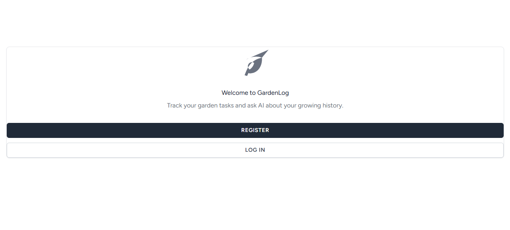
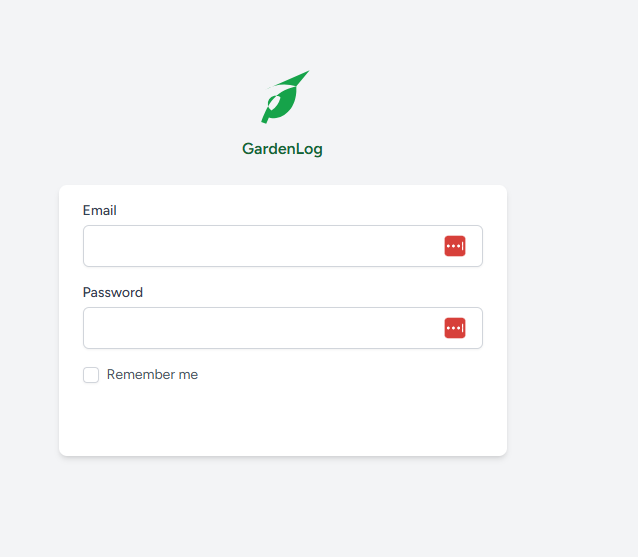
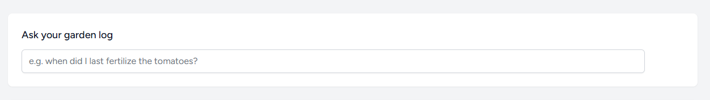
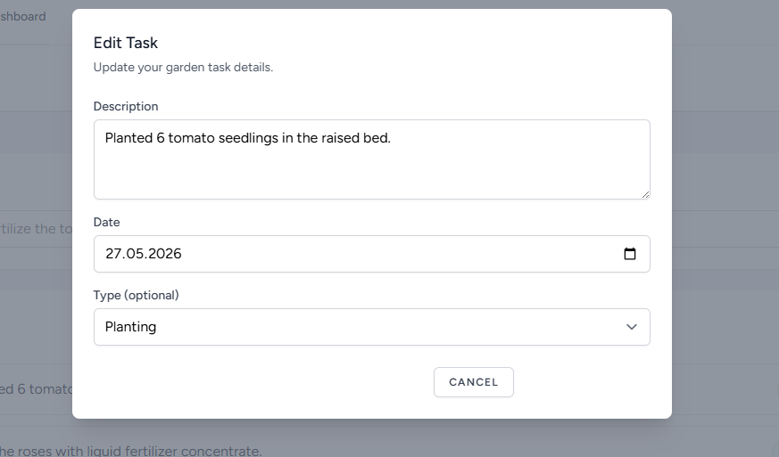

# Proposed changes

**#1 — podmiana logo na obrazek PNG**  
**gdzie**: wszędzie gdzie pojawia się logo — komponent `<x-application-logo>` (`resources/views/components/application-logo.blade.php`), używany w: strona powitalna (`welcome.blade.php`), nawigacja (`navigation.blade.php`), layout gościa (`guest.blade.php`)  
**opis**: obecne logo to komponent SVG/tekstowy; podmienić na obrazek `resources/images/logo.png` (plik już istnieje w repozytorium)

**do sprawdzenia**:
- [ ] logo wyświetla się na stronie powitalnej
- [ ] logo wyświetla się w nawigacji (desktop)
- [ ] logo wyświetla się w layoucie gościa (login/rejestracja)

**#2 — poprawki welcome screen**  
**gdzie**: strona powitalna (`resources/views/welcome.blade.php`)  
**opis**: zmniejszyć szerokość kontenera, dodać paddingi, podmienić logo na `resources/images/logo.png` (powiązane z #1)  

**do sprawdzenia**:
- [ ] zmniejszona szerokość kontenera
- [ ] poprawne paddingi
- [ ] logo podmienione na PNG (zgodnie z #1)

**#3 — (bug) brak buttona submit w formularzach logowania i rejestracji**  
**gdzie**: ekran logowania (`login`) oraz ekran rejestracji (`register`)  
**opis**: po ostatnich zmianach zniknął button potwierdzenia wysłania formularza (submit) — przywrócić go w obu widokach  

**do sprawdzenia**:
- [ ] button submit widoczny na ekranie logowania
- [ ] button submit widoczny na ekranie rejestracji
- [ ] button działa poprawnie (wysyła formularz)

**#4 — (bug) brak przycisku w searchbar "Ask your garden log"**  
**gdzie**: sekcja "Ask your garden log" (searchbar na dashboardzie)  
**opis**: po ostatnich zmianach zniknął przycisk wysyłania zapytania w searchbarze — przywrócić go  

**do sprawdzenia**:
- [ ] przycisk widoczny obok pola wyszukiwania
- [ ] przycisk wysyła zapytanie poprawnie

**#5 — (bug) brak buttona w formularzu dodawania/edycji taska**  
**gdzie**: formularz dodawania i edycji taska  
**opis**: po ostatnich zmianach zniknął button zatwierdzenia formularza (submit) — przywrócić go w widoku dodawania i edycji taska  

**do sprawdzenia**:
- [ ] button submit widoczny w formularzu dodawania taska
- [ ] button submit widoczny w formularzu edycji taska
- [ ] button działa poprawnie (zapisuje task)
